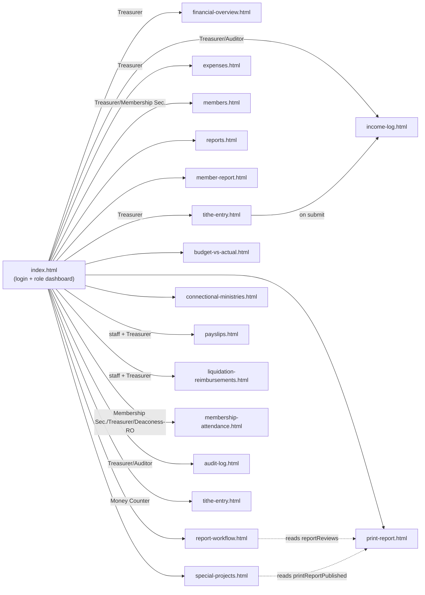
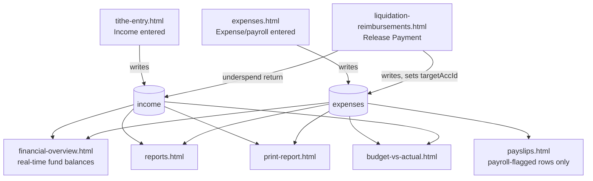
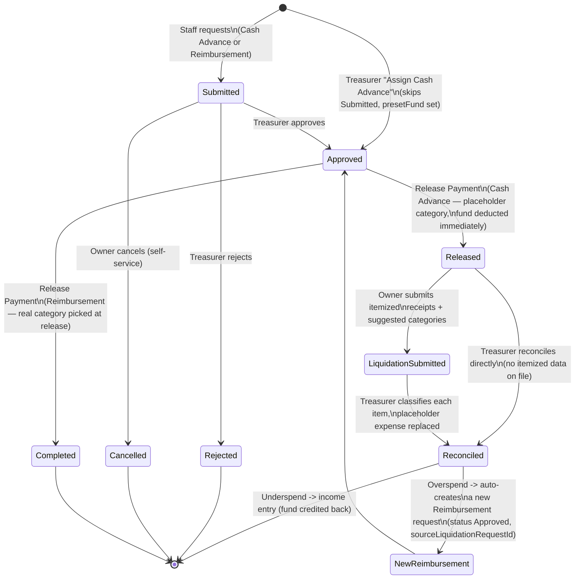
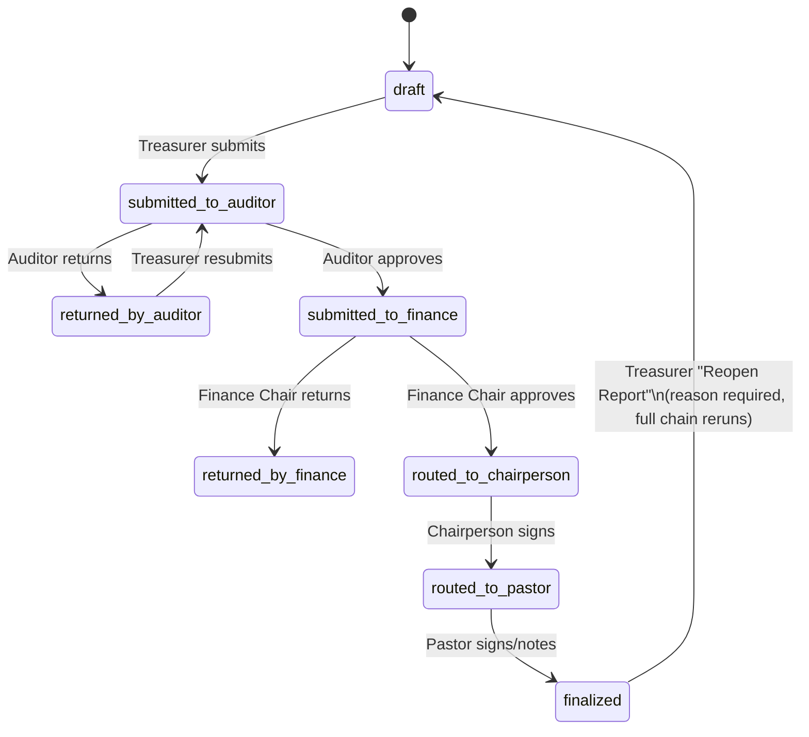

# GraceBooks — Architecture & Feature Map

**Purpose of this document:** a from-scratch survey of the entire repository — architecture, data model, page inventory, cross-page connectivity, and known gaps — written for a second AI reviewer (Fable) to independently audit for flaws, missing connectivity, and missing features. Everything below was verified against the actual code as of this writing, not inferred from other docs. Where a claim couldn't be fully verified, it's marked as an open question.

---

## 1. What this system is

GraceBooks is a finance + membership management system for **Tagaytay United Methodist Church**. It began as a pure static Firebase Hosting site (no build step, no bundler) and has since grown a second distribution channel: a **Capacitor-wrapped Android app** built by CI. `CLAUDE.md` (the project's own onboarding doc) describes only the original static-site architecture and is now **stale** — it doesn't mention the Android shell, the CI workflow, `package.json`/npm dependencies, or several newer pages. That gap itself is worth Fable flagging.

## 2. Tech stack & deployment surfaces

| Surface | Mechanism | Notes |
|---|---|---|
| Web app | Firebase Hosting, serves `public/` | No bundler; each page is a self-contained HTML file with inline `<style>`/`<script>`. Firebase compat SDK v10.7.1 loaded via CDN `<script>` tags. |
| Android app | Capacitor (`capacitor.config.json`, `android/` Gradle project) | `appId: org.tumc.gracebooks`. `server.url` points at the **live production Firebase Hosting URL** (`https://gracebooks-7eebc.web.app`) — the app is a thin WebView wrapper around the hosted site, not an offline bundle, despite `webDir: "public"` also being set. |
| Android CI | `.github/workflows/android-apk.yml` | Builds a **debug** APK on every push to `main` that touches `capacitor.config.json`, `android/**`, or `package.json`, using a checked-in-as-secret debug keystore. Uploads as a 30-day GitHub Actions artifact — no Play Store / release-signing pipeline present. |
| Firebase Firestore | Firebase's document DB | Security rules in `firestore.rules`, all client reads/writes gated by role. |
| Firebase Storage | File uploads | Rules in `storage.rules`, three upload surfaces (receipts, project proofs, signatures). |
| ~~Firebase App Hosting~~ | `apphosting.yaml` | **Deleted.** Confirmed unused — this config is for Cloud Run-backed apps (Next.js/Angular Universal, etc.) and there's no server code in this repo to back it. |
| Node/npm | `package.json`, `package-lock.json` | Exists **only** to support the Capacitor Android build (`@capacitor/android`, `@capacitor/core`, dev deps for `cap sync`/`cap open`). The web app itself still has zero npm dependencies. Its `guardrails` script (pointed at a nonexistent `scripts/guardrails/check-storage-rules.js`) has been removed. |

**Also previously present at repo root, now deleted:** `index.html` and `404.html` at the repository root were the unmodified Firebase CLI scaffold templates from `firebase init hosting`. Since `firebase.json`'s `hosting.public` is `"public"`, Firebase Hosting serves from `public/`, so these root files were never actually deployed or served — confirmed dead and removed.

## 3. Auth & role model

`public/auth.js` is the one genuinely shared module in the codebase, loaded by every authenticated page after the Firebase compat `<script>` tags:

- `requireGraceBooksAuth()` — redirects to `index.html` if not signed in; resolves `window.graceBooksAuthReady` with `{ name, role }` and fires a `gracebooks-auth-ready` DOM event.
- `getGraceBooksProfile(user)` — fetches/caches `userProfiles/{uid}` into `sessionStorage.graceBooksUser`.
- `graceBooksLogout()` — signs out, clears session storage.
- Firebase **App Check** (reCAPTCHA v3) is wired in but **inactive**: `const APP_CHECK_SITE_KEY = '';` — activation is a no-op until someone pastes a real site key in from the Firebase Console and redeploys, then flips Firestore/Storage to "Enforced" mode. This is a known, tracked gap (`PHASE-PLAN.md` Phase 7), not a surprise, but still an open item.

Login uses Firebase Auth email/password with synthetic emails (`username@gracebooks.local`). **Roles are not Auth custom claims** — they live in `userProfiles/{uid}` Firestore docs, provisioned manually via Firebase Console (`AUTH-MIGRATION.md`). Client writes to `userProfiles` are denied by rules.

### Role → menu → collection matrix

Ten roles exist. `public/index.html`'s `menus` object is the single source of truth for what each role can navigate to from the dashboard (though several pages have **no client-side role gate at all** beyond this — see §7 for exceptions and §9 for the security implication).

| Role | Dashboard menu items | Primary purpose |
|---|---|---|
| **Treasurer** | Financial Overview, Income Entry, Expenses, Members, Reports, Member Report View, Report Workflow, Income Log, Print Report, Budget vs Actual, Special Projects, Connectional Ministries, Payroll/Payslips, Liquidation & Reimbursements, Attendance, Audit Log | Primary editor for nearly all financial collections. |
| **Pastor** | Reports, Member Report View, Budget vs Actual, Special Projects, Connectional Ministries, Print Report, Report Workflow, My Payslips, Liquidation & Reimbursements | Mostly read-only; signs reports; own payroll/liquidation. |
| **Auditor** | Reports, Member Report View, Budget vs Actual, Special Projects, Connectional Ministries, Print Report, Report Workflow, Audit Log, Income Log, Expense Log | Sole approver in the audit step; only non-Treasurer role with Audit Log access. |
| **Finance Chair** | Reports, Member Report View, Budget vs Actual, Special Projects, Connectional Ministries, Print Report, Report Workflow | Approves Chairperson/Pastor notes in the workflow; no direct entry rights. |
| **Chairperson** | Same as Finance Chair | Signatory only. |
| **District** | Same as Finance Chair | Signatory/observer only. |
| **Deaconess** | Reports, Budget vs Actual, Special Projects, Connectional Ministries, Print Report, My Payslips, Liquidation & Reimbursements, Attendance (read-only) | Staff payroll + liquidation flows; recently granted read-only Attendance. |
| **Admin Assistant** | My Payslips, Liquidation & Reimbursements | Narrowest menu of any role — staff payroll/liquidation only. |
| **Money Counter** | Income Entry Log | Income entry only; per `firestore.rules` can also `create` on `members`, but no menu link reaches `members.html`. |
| **Membership Secretary** | Weekly Attendance, Members | Cannot see any finance/report data; owns the member database and attendance. |

## 4. Data model

### Firestore collections

| Collection | Purpose | Read | Create | Update/Delete |
|---|---|---|---|---|
| `userProfiles` | Role + name per uid | self, or Treasurer (any) | — (Console-provisioned only) | — |
| `userSignatures` | Cached per-user signature image metadata | Treasurer/Pastor/Auditor/District/Finance Chair/Chairperson | self | self |
| `income` | All income/tithe/offering entries | Treasurer/Pastor/Deaconess/Auditor/District/Finance Chair/Chairperson | Treasurer/Money Counter | Treasurer |
| `expenses` | All expense/payroll/transfer entries | Treasurer/Pastor/Deaconess/Auditor/District/Finance Chair/Chairperson, or payroll-record owner | Treasurer | Treasurer |
| `members` | Member roster | Treasurer/Pastor/Deaconess/Auditor/District/Finance Chair/Chairperson/Money Counter/Membership Secretary | Treasurer/Money Counter/Membership Secretary | Treasurer/Membership Secretary |
| `attendance` | Weekly attendance records | any signed-in user | Treasurer/Membership Secretary | Treasurer/Membership Secretary |
| `churchObligations` | Connectional/apportionment obligations | Treasurer/Pastor/Deaconess/Auditor/District/Finance Chair/Chairperson | Treasurer | Treasurer |
| `reportReviews` | Report approval-workflow state machine | same read list as above | Treasurer | Treasurer/Auditor/Finance Chair/Chairperson/Pastor |
| `notifications` | Dashboard-bell notifications | any signed-in user | any signed-in user | — (immutable) |
| `liquidationRequests` | Cash advance / reimbursement lifecycle | Treasurer/Auditor, or the requester | Pastor/Deaconess/Admin Assistant (own uid only) or Treasurer (any) | Treasurer, or owner for constrained transitions only |
| `specialProjects` / `specialProjectEntries` / `specialProjectCosts` | Special-project fund ledger | Treasurer/Pastor/Deaconess/Auditor/District/Finance Chair/Chairperson | Treasurer | Treasurer |
| `auditLogs` | Immutable action history | Treasurer/Auditor | any signed-in user | Treasurer only |
| `budgets` | Per-year budget category tree + amounts | any role except Membership Secretary | Treasurer | Treasurer |
| `settings` | Grab-bag of singleton config docs (see below) | any role except Membership Secretary | Treasurer | Treasurer |

**`settings` sub-documents** (all under the one `settings` collection, gated identically by the rule above):

| Doc ID | Used by | Contents |
|---|---|---|
| `payrollTemplate` | `expenses.html` | Default weekly payroll generation template |
| `recurringExpenses` | `expenses.html` | Saved recurring-expense presets |
| `yearsConfig` | `expenses.html`, `print-report.html`, `budget-vs-actual.html` | Available fiscal years list |
| `accountStructure` | `print-report.html`, `budget-vs-actual.html` | Category ordering/grouping for reports |
| `beginningBalances` | `financial-overview.html`, `member-report.html`, `print-report.html` | Opening balances per fund |
| `cashControlSettings` | `financial-overview.html` | Essential monthly expense / approved payables thresholds |
| `signatories` | `print-report.html` | Signature-block setup for the printed report |

**Time-bomb, by design but worth flagging for a plan:** `firestore.rules`' `testingAccessOpen()` gates all signed-in access behind `request.time < timestamp.date(2027, 1, 1)`. After that date, **all client access fails closed** — mirrored client-side in `index.html`'s `TESTING_END_DATE` warning banner. There's no visible plan in `PHASE-PLAN.md` for what happens architecturally once that date is reached (presumably the rule needs to be replaced with real production access control before then).

### Storage buckets (`storage.rules`)

| Path | Constraints | Write access |
|---|---|---|
| `expense-receipts/{expenseId}/{fileName}` | image/PDF, ≤5MB | Treasurer only |
| `project-proofs/{entryId}/{fileName}` | image/PDF, ≤5MB | Treasurer only |
| `signatures/{uid}/{fileName}` | image only, ≤2MB | owner only |
| `liquidation-receipts/{requestId}/{fileName}` | image/PDF, ≤5MB | Treasurer or the request's owner |

All paths use randomized storage tokens (`crypto.randomUUID()` or timestamp+random fallback), not the original filename, per the Phase 4B security hardening. Reads are open to any signed-in user (needed so non-Treasurer roles can view receipts during report review). **Deferred, not yet built:** server-side file-signature/magic-byte validation via a Cloud Function — uploads are currently trusted based on browser-reported MIME type and size only.

## 5. Page inventory

Every page lives in `public/`, is a standalone HTML file, and (with listed exceptions) links only back to `index.html` — there is very little **forward** cross-page navigation in this app; most connectivity happens through shared Firestore collections, not hyperlinks.

| Page | LOC | Purpose | Firestore collections | Forward links |
|---|---|---|---|---|
| `index.html` | 681 | Login + role-based dashboard + notification bell | `userProfiles`, `notifications` | Every other page (menu) |
| `dashboard.html` | 24 | Dead redirect stub → `index.html` | — | `index.html` |
| `tithe-entry.html` | 2030 | Income entry (single/bulk), member typeahead, draft recovery | `members`, `income`, `auditLogs` | `income-log.html` on submit |
| `income-log.html` | 308 | Read-only income ledger with filters | `income` | — |
| `expenses.html` | 1212 | Expense entry, payroll generation, receipt uploads | `expenses`, `settings.payrollTemplate`, `settings.recurringExpenses`, `settings.yearsConfig`, `budgets`, `auditLogs` | — |
| `financial-overview.html` | 1593 | Real-time fund balances (**deliberate exception** — do not convert to one-time fetch without approval) | `income`, `expenses`, `settings.beginningBalances`, `settings.cashControlSettings` | — |
| `members.html` | 412 | Member roster CRUD + CSV import | `members` | — |
| `membership-attendance.html` | 476 | Weekly attendance entry + trend chart | `attendance`, `members`, `auditLogs` | — |
| `member-report.html` | 1125 | Read-only aggregated member/financial dashboard | `settings.beginningBalances`, `income`, `expenses`, `churchObligations`, `attendance` | — |
| `reports.html` | 1568 | Analytics/KPIs, trend graphs, **also has its own `churchObligations` CRUD** | `income`, `expenses`, `attendance`, `churchObligations` | — |
| `print-report.html` | 2135 | Consolidated printable report (monthly/annual/special-project) | `settings.*` (4 docs), `members`, `income`, `expenses`, `churchObligations`, `specialProjects*` (3), `reportReviews` (read) | — |
| `report-workflow.html` | 882 | Approval-chain state machine + canvas signature capture | `reportReviews`, `userSignatures`, `auditLogs`, `notifications` | — |
| ~~`review-confirm.html`~~ | 825 | **Deleted.** Was unreachable/dead — no Firestore calls, nothing linked to it, sessionStorage keys didn't match tithe-entry.html's actual scheme. Removed after this review. | — | — |
| `special-projects.html` | 1486 | Special-project fund ledger, linked expense/income entries | `specialProjects*` (3), `expenses`, `income`, `budgets`, `auditLogs` | — |
| `budget-vs-actual.html` | 1332 | Annual budgeting + variance reporting | `budgets`, `settings.accountStructure`, `settings.yearsConfig`, `income`, `expenses` | — |
| `connectional-ministries.html` | 702 | Obligation tracker — **parallel implementation of `reports.html`'s obligations feature, plus delete** | `churchObligations`, `auditLogs` | — |
| `audit-log.html` | 421 | Audit trail viewer + one-time backfill tool | `auditLogs`, `expenses`/`income` (backfill only) | — |
| `payslips.html` | 611 | Per-employee payslip generation from payroll expense records | `expenses` (payroll-flagged only) | — |
| `liquidation-reimbursements.html` | 1312 | Cash advance / reimbursement full lifecycle | `liquidationRequests`, `userProfiles` (staff list), `budgets` (categories), `expenses`, `income`, `auditLogs`, `notifications` | — |

## 6. Connectivity & lifecycle diagrams

### 6.1 Dashboard-centric navigation

Almost all navigation is a star topology through `index.html` — pages don't link to each other, they link back to the dashboard, which routes by role.

*(dotted arrows = data dependency without a hyperlink. `review-confirm.html`, previously shown here as an orphaned dead page, was deleted after this review.)*

### 6.2 Money flow (where a peso actually goes)

### 6.3 Liquidation & Reimbursement lifecycle (state machine)

This is the most complex single feature in the app; a bug or gap here has direct cash-handling consequences.

### 6.4 Report approval workflow (state machine, `report-workflow.html`)

`print-report.html` reads `reportReviews` to show a finalized-report banner, but nothing links from `report-workflow.html` to `print-report.html` or back — the two pages are coupled only through shared Firestore state, not navigation.

## 7. Known issues & flaws found during this review

Ranked roughly by real-world impact. **Update:** items 1, 5, 9 (partially), and 10 were actioned after this review; see the strikethrough/status notes below and `PHASE-PLAN.md`'s "Architecture Review Follow-up" section for exact detail. A new finding (0, below) surfaced while fixing item 9's `guardrails` script gap.

0. **NEW — `storage.rules` hardcodes one Treasurer's Auth UID.** `expense-receipts` and `project-proofs` gate on `isTreasurer() { return request.auth.uid == 'CrJfm5bwpEhH3DCaKXgMntD0LHI3'; }` instead of role-based `hasRole(['Treasurer'])`, which the same file's own `liquidation-receipts` path already uses successfully. This predates the liquidation/reimbursement work in this repo — not a merge accident. **Deliberately left as-is**: an earlier standing note in `PHASE-PLAN.md` records that `firestore.get()` inside Storage rules previously caused receipt uploads to fail outright, which is the likely reason the UID was hardcoded as a workaround; changing the two most-used receipt paths without live testing risked silently breaking Treasurer receipt uploads. If the Treasurer's Auth account is ever recreated, this will need fixing then.
1. ~~`income-log.html` runs on Firebase SDK v8.10.1~~ **Fixed** — upgraded to the same v10.7.1 compat build as every other page (drop-in script-tag swap; the page only used namespaced-style calls that compat preserves).
2. ~~`review-confirm.html` is dead code.~~ **Deleted** — confirmed zero Firestore calls, no auth gate, unreachable, misleading UI copy.
3. **`reports.html` and `connectional-ministries.html` both fully own `churchObligations`.** Two independently-maintained CRUD implementations of the same collection, with `connectional-ministries.html` being the more complete one (has delete; `reports.html` doesn't). **Decision: keep both for now** — not consolidated.
4. **The `.treasurer-only { display: none; }` + `el.style.display = ''` bug pattern** (found and fixed in `liquidation-reimbursements.html` this session — setting an inline style to `''` doesn't override a CSS class's `display: none`). Checked every other page for the same pattern; found no other live instance, but this class of bug (CSS-default vs. JS-toggle mismatch) is exactly the kind of thing worth a second, independent pass.
5. **Fragile fund-bucketing fallback in `financial-overview.html`.** Its listeners resolve which account an expense/income doc belongs to via `data.targetAccId || (data.payment === 'Bank Transfer' ? 'cash-bank' : data.payment === 'Petty Cash' ? 'petty-cash' : 'cash-hand')`. Any write **without** explicitly setting `targetAccId` silently miscategorizes into "Cash on Hand". **Fixed** in `expenses.html`'s two expense-writing paths (manual entry, batch payroll) — both now set `targetAccId`. `special-projects.html` was audited and found already correct. A historical-data backfill tool (`audit-log.html` → "Fix Missing Fund Assignment", Treasurer-only) was also added to correct existing `expenses` docs written before this fix; it's idempotent and safe to re-run. Not yet audited: whether `income` docs have an analogous gap on their `targetAccount` field.
6. **No client-side role gate on several pages that should probably have one for UX consistency**, even though Firestore rules are the real enforcement: `members.html`, `budget-vs-actual.html`, `member-report.html`, `income-log.html`, `print-report.html`. Compare to `special-projects.html`/`connectional-ministries.html`'s consistent `roleIs(...)` + `can-manage` CSS class pattern. Not a security hole (rules cover it), but a wrong role reaching these pages via direct URL gets silent Firestore permission errors instead of a clear "you can't do this" message.
7. **Firestore `testingAccessOpen()` time-bomb** expires 2027-01-01 with no visible replacement plan yet.
8. **App Check is wired but not activated** (empty site key placeholder) — requires a manual Firebase Console step I have no access to perform; tracked as a known gap, not a surprise.
9. **No automated tests, linting, or CI for the web app** — the only CI (`android-apk.yml`) builds the Android debug APK, nothing validates the Firestore/Storage rules or page JS before merge. ~~`package.json`'s `guardrails` script referenced a file that doesn't exist~~ **Fixed** — the dead script entry was removed. A real automated storage-rules guardrail was not built (the finding-0 hardcoded-UID pattern would need a deliberate exception if one is written later, since it's now a known/accepted deviation).
10. ~~`apphosting.yaml` and root-level `index.html`/`404.html` appear to be unused scaffold leftovers~~ **Deleted** — confirmed never served (Hosting serves from `public/`).
11. **No pagination on several list reads** (e.g. `audit-log.html` caps at 500 via `.limit()`, but pages like `expenses.html`'s ledger and `special-projects.html` fetch full collections with `.get()`) — fine at current data volume for a single church, but a scale note worth having on record.
12. **Role names are free-text strings in Firestore with no enum/validation**, matched by exact string comparison throughout the client code (occasionally case-normalized, e.g. `tithe-entry.html`'s `.toLowerCase().trim()`, but most pages compare raw `profile.role === 'Treasurer'`). A typo'd role in a `userProfiles` doc silently breaks all access for that user with no clear error — the same root-cause *class* of bug as finding 4, just at the data layer instead of the CSS layer.

## 8. Missing / deferred features (from `PHASE-PLAN.md` + this review)

- **Cloud Function file-signature validation** for uploads (magic-byte inspection, quarantine/block flow) — planned, not built. Uploads currently trust browser-reported MIME type only.
- **Email notifications** — only in-app (dashboard bell) notifications exist; no provider chosen yet (SendGrid, Firebase Extensions, etc.).
- **Official membership database import** (CSV mapping, duplicate detection, rollback-safe audit log) — explicitly deferred.
- **Android release signing / Play Store pipeline** — only a debug APK build exists; no path to a signed release build or store listing.
- ~~Consolidation of the duplicate `churchObligations` UIs~~ — decided: keep both for now.
- ~~Decision on `review-confirm.html`~~ — deleted.
- ~~`apphosting.yaml` / root scaffold files~~ — deleted.
- **`storage.rules` hardcoded-UID cleanup** — deliberately deferred (§7.0); needs a tested fix, not a blind one.
- **`income` docs' `targetAccount` field** — not yet audited for the same gap as §7.5; scope was limited to `expenses` this round.

## 9. Suggested focus areas for Fable's review

1. ~~Audit `expenses.html` and `special-projects.html`~~ **Done** — see §7.5. Consider auditing `income`-writing paths (`tithe-entry.html`, `financial-overview.html`'s transfer function) for the analogous `targetAccount` gap, which was not checked this round.
2. `churchObligations` duplication — decision made (keep both); no further action unless that changes.
3. ~~Verify `income-log.html`'s old SDK~~ **Done** — upgraded.
4. Do an independent pass for the CSS-default vs. JS-toggle visibility bug class (§7.4) — I checked but a second set of eyes on a 19k-line, no-shared-component codebase is worth it.
5. Consider whether role validation should move from free-text string comparison to something safer (enum check with a clear error state) given how easily a typo silently breaks access (§7.12).
6. ~~Confirm whether `apphosting.yaml`, root scaffold, and the `guardrails` reference are dead~~ **Done** — confirmed and removed.
7. **New:** decide whether/how to fix `storage.rules`' hardcoded-UID Treasurer check (§7.0) — needs a live test of receipt upload/replace/delete after switching to `hasRole(['Treasurer'])` before it can be safely changed.
